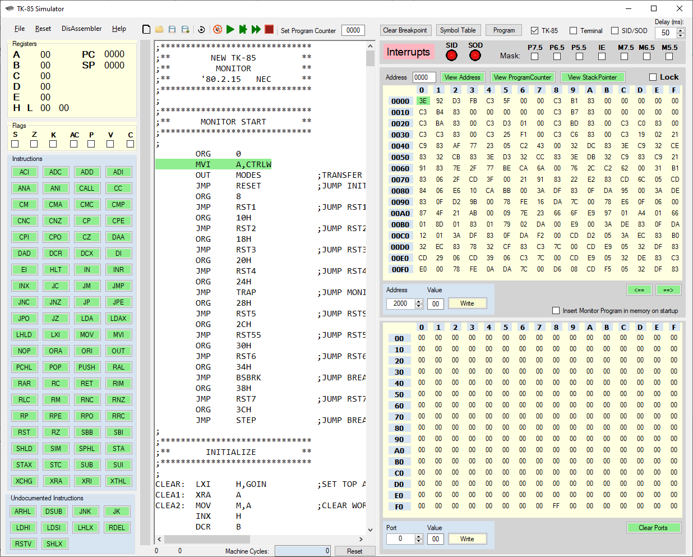
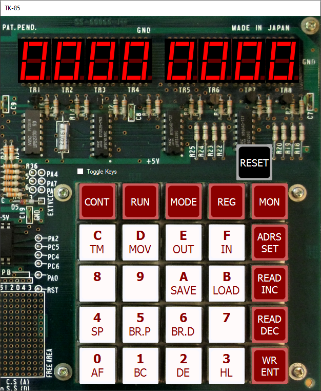

# TK-85
Simulator for the NEC TK-85 developers board.

This is an assembler/disassembler for the Z80 microprocessor. 
It can also simulate a NEC TK-85 developers board (keyboard/display).

Remember that if you use the monitor source program, it is best to set the DELAY constant to 0 (now 71)
and the MSEC9 constant to 1 (now 14).
This to prevent a long waiting delay for the keyboard to respond (the delay is used to avoid key bouncing).
Also fast run (icon >>) is recommended to use the keyboard/display, even with the reduced delays.

Copyright (c) 2024 Dirk Prins

Permission is hereby granted, free of charge, to any person obtaining a copy of this software and associated documentation files (the "Software"), to deal in the Software without restriction, including without limitation the rights to use, copy, modify, merge, publish, distribute, sublicense, and/or sell copies of the Software, and to permit persons to whom the Software is furnished to do so, subject to the following conditions:

The above copyright notice and this permission notice shall be included in all copies or substantial portions of the Software.

THE SOFTWARE IS PROVIDED "AS IS", WITHOUT WARRANTY OF ANY KIND, EXPRESS OR IMPLIED, INCLUDING BUT NOT LIMITED TO THE WARRANTIES OF MERCHANTABILITY, FITNESS FOR A PARTICULAR PURPOSE AND NONINFRINGEMENT. IN NO EVENT SHALL THE AUTHORS OR COPYRIGHT HOLDERS BE LIABLE FOR ANY CLAIM, DAMAGES OR OTHER LIABILITY, WHETHER IN AN ACTION OF CONTRACT, TORT OR OTHERWISE, ARISING FROM, OUT OF OR IN CONNECTION WITH THE SOFTWARE OR THE USE OR OTHER DEALINGS IN THE SOFTWARE.
